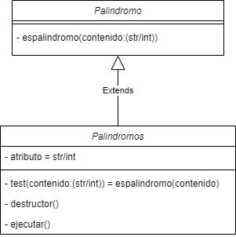
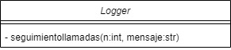

<h1 align="center">Clases</h1>

<h3 align="center">Autores de este proyecto:</h3>

1. [@jmedina28](https://github.com/jmedina28)
1. [@xavitheforce](https://github.com/Xavitheforce)
---
En este [repositorio](https://github.com/jmedina28/EjerciciosClases) quedan resueltos los ejercicios de clases para POO. Para llevar a cabo el proyecto nos hemos documentado a través de la teoría que se encuentra en el campus virtual y de diversas fuentes que hemos encontrado.
***
## Índice
1. [Palíndromo (Método de clase).](#id1)
3. [Palíndromo (Método de instancia).](#id2)
3. [Puzzle.](#id3)
4. [Logger.](#id4)
***

## Ejercicio 1: Palíndromo (Método de clase)<a name="id1"></a>

En este ejercicio he creado la clase Palindromo la cual contiene el método esPalindromo() el cual comprueba si una frase, una palabra, una combinación numérica o de símbolos forman palíndromos.

El código empleado para resolverlo es el siguiente:

```python
# Palíndromos

class Palindromo:

    def esPalindromo(contenido):
        a, b = 'áéíóúüñÁÉÍÓÚÜ', 'aeiouunAEIOUU'
        tilde = str.maketrans(a, b)
        contenido = contenido.lower()  # Convierto el texto en minúsculas.
        contenido = contenido.replace(' ', '')  # Quito los espacios.
        contenido = contenido.translate(tilde)  # Elimino las tildes.
        lista = list(contenido)  # Convierto el contenido en una lista.
        listaresultado = list(reversed(contenido))  # Invierto la lista.
        if lista == listaresultado:  # Comparo el contenido original con el inverso.
            print(True)
            exit()
        else:
            print(False)
            exit()
```


## Ejercicio 2: Palíndromo (Método de instancia)<a name="id2"></a>

En este ejercicio he reutilizado la función del ejercicio anterior que comprueba si una palabra/frase es un palíndromo. Adicionalmente, he creado un fichero que almacena los distintos valores que la variable va tomando para poder registrarlos, además de una función que imprime en pantalla el valor actual que toma la variable de no ser esta un palíndromo. En caso contrario, el método ejecutar imprime el último registro antes de modificar la variable.


El código empleado para resolverlo es el siguiente:
 
 ```python
# Palíndromos

from operator import truediv
import os
import re


class Palindromos():
    def __init__(self, atributo):
        self.atributo = atributo

    def test(self, contenido):
        a, b = 'áéíóúüñÁÉÍÓÚÜ', 'aeiouunAEIOUU'
        self.tilde = str.maketrans(a, b)
        contenido = contenido.lower()  # Convierto el texto en minúsculas.
        contenido = contenido.replace(' ', '')  # Quito los espacios.
        contenido = contenido.translate(self.tilde)  # Elimino las tildes.
        self.lista = list(contenido)  # Convierto el atributo en una lista.
        # Invierto la lista.
        self.listaresultado = list(reversed(contenido))
        # Comparo el atributo original con el inverso.
        if self.lista == self.listaresultado:
            return True
        else:
            return False

    def destructor(self):
        self.doct = open("Palindromos.txt", "r")
        ultima_linea = self.doct.readlines()[-1]
        if Palindromos(self.atributo).test(self.atributo) == False:
            print(str(ultima_linea))
        self.doct.close()

    def ejecutar(self):
        self.doct = open("Palindromos.txt", "r")
        self.ultima_linea = self.doct.readlines()[-1]
        if self.ultima_linea != "#" and Palindromos(self.atributo).test(self.ultima_linea) == True:
            print(str(self.ultima_linea))
        self.doct.close()
        self.m_atributo = Palindromos(self.atributo).atributo.upper()
        self.doct = open("Palindromos.txt", "a")
        self.doct.write("\n"+str(self.m_atributo))
        self.doct.close()
        if Palindromos(self.atributo).test(self.atributo) == True:
            print(True)
        else:
            print(False)
        Palindromos(self.atributo).destructor()
```
Pregunta adicional: ¿por qué se muestra RADAR después de la instanciación Palindromo("sonar")?
La respuesta es porque RADAR es un palindromo, mientras que SONAR no, así que probablemente cuando la instancia es un palindromo no la destruye, sino que espera a la siguiente instancia para ello, mientras que si no es un palindromo es probable que inmediatamente la destruya. Como al destruir, el codigo muestra el dato, eso explica por qué RADAR se muestra despues de instanciar SONAR.

El UML es el siguiente:

<br>

<br>


## Ejercicio 3: Puzzle<a name="id3"></a>


El código con su funcionamiento explicado es el siguiente:
 
 ```python
 class A: 
    def z(self): 
        return self 
 
    def y(self, t): 
        return len(t)

def puzzle(): 
    a = A # a es la clase definida A
    y = a.z # esta linea crea una variable "y" y la convierte en la funcion z de la clase A
    print(y(a)) #La variable y (que es la funcion z de la clase A) recoge un valor y lo devuelve.
    #En este caso y recoge a, que es la clase A, y por eso devuelve <class '__main__.A'>
    aa = a() #ambos son la misma clase, pero variables distintas
    print(a())
    print(aa)
    print(aa is a()) #El resultado es Falso porque los objetos(las clase) estan "guardadas" en posiciones distintas,
    # asi que aunque funcionalmente son lo mismo, la maquina las recuerda/almacena de distinta manera
    z = aa.y #Convierte la variable z en la funcion y que devuelve la longuitud de una variable
    print(z(())) #la funcion y recibiendo un valor (tupla) vacio, por lo que devuelve 0
    print(a().y((a,))) #la funcion y de la clase A recibiendo un valor (tupla) de 1 elemento, por lo que devuelve 1
    print(A.y(aa, (a,z))) #la funcion y llamada desde A, que recoge una tupla de 2 elementos(devuelve 2)
    # El aa es el equivalente al self en al funcion y, (la clase con self). Llamar A directamente daria error(faltan elementos)
    print(aa.y((z,1,'z'))) #la funcion y de la clase A recibiendo un valor (tupla) de 3 elemento, por lo que devuelve 3

```

## Ejercicio 4: Logger<a name="id4"></a>

En este ejercicio he creado la clase Logger la cual ejecuta un método que crea un fichero de text en el que almacena n cantidad de llamadas establecidas por el usuario.


El código empleado para resolverlo es el siguiente:
 
 ```python
# Logger

import os
import time

class Logger:

    def seguimientollamadas(n, mensaje):
        print("Se está generando el fichero de texto...")
        fichero = open("Logger.txt", "a")
        fichero.write("--Start log--")

        for i in range(1, int(n)+1):
            if i == 1:
                fichero.write("\nPrimer mensaje: "+ str(mensaje))
            else:
                fichero.write("\n" + str(i) + " mensaje: " + str(mensaje))
        fichero.write("\n--End log: " + str(n) + " log(s)--")
        fichero.close()
        time.sleep(4)
        print("Usted ya puede abrir el fichero que se encuentra dentro de la carpeta en la que está ejecutando esto.")
        time.sleep(8)
        variable = int(input(
            "¿Desea limpiar el registro? (Pulse 1 en caso afirmativo, en caso contrario pulse cualquier otro valor): "))
        if variable == 1:
            os.remove("Logger.txt")
            exit()
        else:
            print("En este caso, si desea volver a ejecutar el programa tendrá que eliminar manualmente el fichero de texto.")
            exit()
```
El UML es el siguiente:

<br>

<br>

